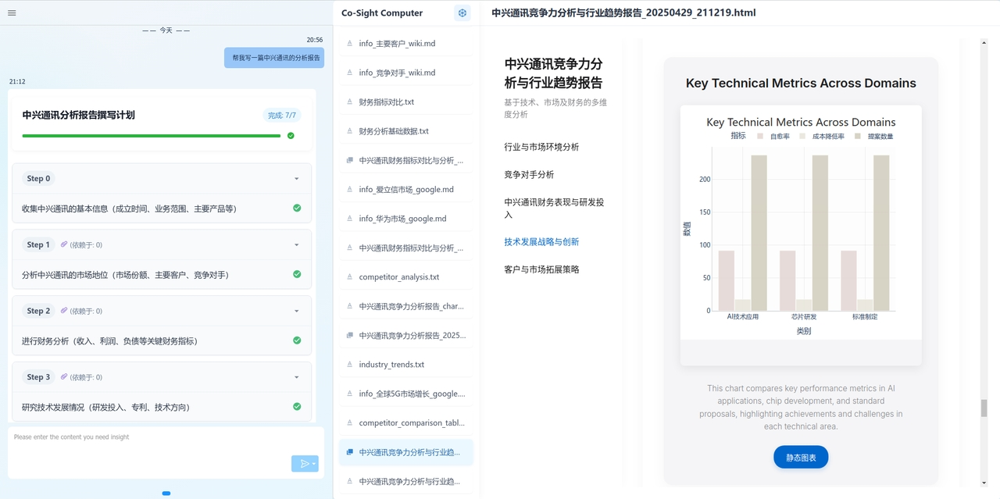

## 🔍样例演示

| 场景       | 示例链接                                                                          | 效果预览                                        |
| -------- | ----------------------------------------------------------------------------- | ------------------------------------------- |
| **行业研究** | [中兴通讯分析报告](https://www.youtube.com/watch?v=SNd8kYPxr3s)                       |  |
| **个人生活** | [2025年五一上海旅游攻略](https://www.youtube.com/watch?v=IkAGq0e1Lio&feature=youtu.be) |  |
| **新闻热点** | [特朗普关税政策全球影响分析](https://www.youtube.com/watch?v=19-BmlHuG_E)                  |  |
| **...**  |                                                                               |                                             |


## 🛠安装指南

1. **准备环境**：python版本>=3.11

2. **安装依赖**：
```shell
pip install -r requirements.txt
```


## ⚙️配置说明

1. **拷贝模板`.env_template`并生成 `.env`**（该文件已被加入 `.gitignore`，可安全存储私密信息）：
2. **编辑** `.env` **配置核心参数**：
	1. 大模型配置：配置相对应的大模型地址，模型名称，API-KEY等，可进一步（可选）对规划、执行、工具、多模态模型做配置；
	2. 搜索引擎配置（可选）：配置相关搜索引擎API-KEY；


## ▶️ 快速启动

1. **启动后台服务**：cosight_server/deep_research/main.py

2. **打开浏览器，访问：**
`http://localhost:7788/cosight/`
3. **在输入框中输入你的第一个任务，体验智能研究引擎的强大能力！**


## 🤝 贡献指南

非常欢迎 PR、Issue！如果你有任何想法或建议：

- 提交 Issue：描述你的想法与问题。
  
- 发起 PR：完善文档、添加示例或优化功能。
  

一起让 Co-Sight Agent 更加强大。

