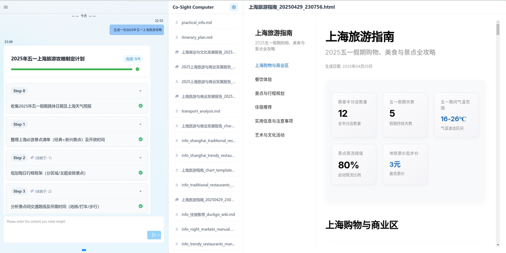
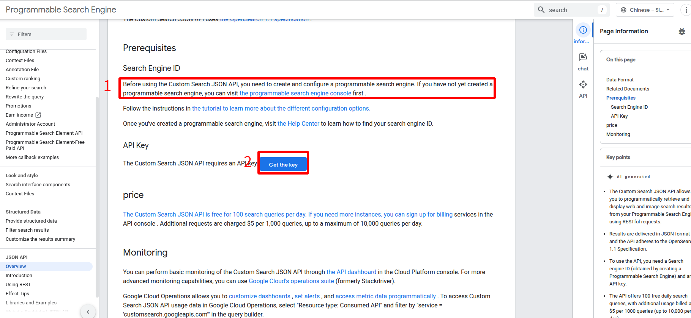
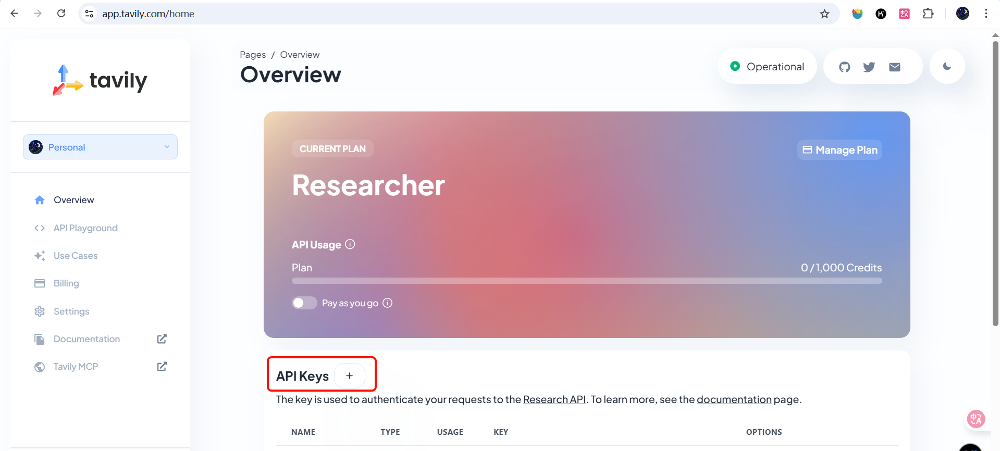
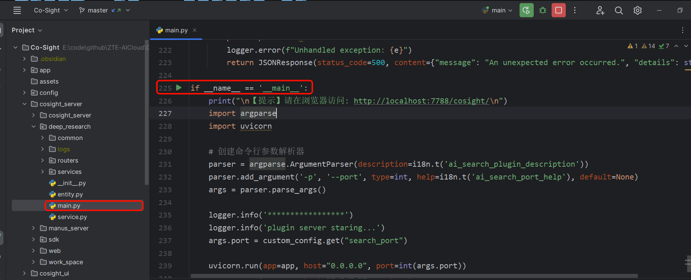
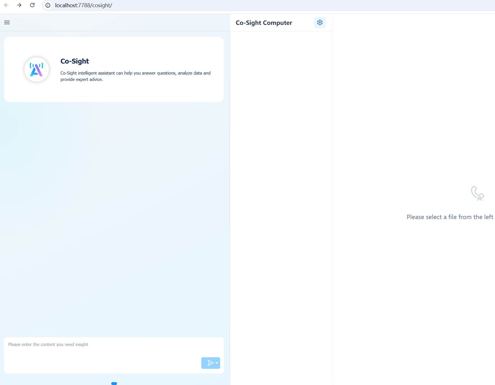

## 🚀 Still worried about the invitation code? One-click deployment of Co-Sight to quickly build your own Manus-like system!

[](README-zh.md)

Since the release of Manus, some closed-source platforms have faced problems such as high cost, limited access, and difficulty in privatization deployment, although they have excellent user experience and commercial support. Although open source frameworks have higher flexibility and transparency, they are slightly lacking in terms of functional integrity, style richness, and stability.

**Co-Sight** Committed to striking the best balance between cost, quality, stability and ease of use. It supports low-cost large models to generate high-quality and beautiful reports comparable to Claude models, and can be flexibly deployed in private environments, helping enterprises and individuals quickly build their own Manus-like systems.

## 🔍Sample Demo

| Scene                 | Example links                                                                 | Preview of the effect                           |
|-----------------------|-------------------------------------------------------------------------------|-------------------------------------------------|
| **Industry Research** | [ZTE analysis report](https://www.youtube.com/watch?v=SNd8kYPxr3s)                       |      |
| **Personal life**     | [2025 May Day Shanghai Travel Guide](https://www.youtube.com/watch?v=IkAGq0e1Lio&feature=youtu.be) | <br> |
| **Hot news**              | [Analysis of the Global Impact of Trump's Tariff Policy](https://www.youtube.com/watch?v=19-BmlHuG_E)                  |      |
| **...**               |                                                                               |                                                 |

**We welcome you to contribute more examples in the Lab to enrich our case library!**  

GitHub Address：[https://github.com/Co-Sight-Series/Co-Sight-Lab](https://github.com/Co-Sight-Series/Co-Sight-Lab)

## 🛠Installation Guide

1. **Download the project**：You can choose one of the following methods to download the project to your local computer：
   
   **1. Use Git clone**
   Visit https://github.com/ZTE-AICloud/Co-Sight ，Click on the green 'Code' button,

   ```bash
   # 1. Select HTTP protocol
   git clone https://github.com/ZTE-AICloud/Co-Sight.git
   
   # 2. Select SSH
   git clone git@github.com:ZTE-AICloud/Co-Sight.git
   
   cd Co-Sight
   ```

   **2. Download the zip file**
   Visit https://github.com/ZTE-AICloud/Co-Sight ， Click on the green 'Code' button, select 'Download ZIP', download it and unzip it to enter the project directory.

2. **Prepare the environment**：python version >= 3.11
  
3. **Install dependencies**：  Run the following command in the project directory to install dependencies:
```shell
pip install -r requirements.txt
```

## ⚙️Configuration

1. **Copy the template`.env_template`and generated `.env`**（the document has been joined `.gitignore`，securely store private information）：
2. **edit** `.env` **configure core parameters**：
	1. Large model configuration: Configure the corresponding large model address, model name, API-KEY, etc., and further (optionally) configure the planning, execution, tools, and multi-modal model;
	2. Search engine configuration (optional): configure the API-KEY of the relevant search engine;
		1. Google Search how to apply：https://developers.google.com/custom-search/v1/overview?hl=zh-cn#api_key
		   	
		2. Tavily Search how to apply：https://app.tavily.com/home
		   
3. **Configure MCP tool**
```python
# 在工程根路径下的config/mcp_server_config.json按需配置如下信息,支持配置多个
[
  {
    "skill_name": "MCP技能名称",
    "skill_type": "local_mcp",
    "display_name_zh": "MCP工具中文名称",
    "display_name_en": "MCP工具英文名称",
    "description_zh": "MCP工具中文描述",
    "description_en": "MCP工具中文描述",
    "mcp_server_config": {
      "command": "python",
      "args": [
        "mcp_server.py"
      ]
    }
  }
]
```
		  
## ▶️ Quick Start

1. **start the service**：cosight_server/deep_research/main.py

2. **open your browser and visit**
`http://localhost:7788/cosight/`
3. **Enter your first task in the input box and experience the power of the intelligent research engine!**




## 🐳 Use Docker

1. download the docker offline image
https://github.com/ZTE-AICloud/Co-Sight/releases/download/v0.0.1/co-sight-v001.tar

2. start the docker image
```shell
# load an offline image
docker load -i co-sight-v001.tar
# start the docker container
docker run -d -p 7788:7788 co-sight
# copy the configured .env file into the container (the model and search engine will be configured in a Co-Sight interface)
docker cp .env ac39023b3b3fdc3245ec1cc0293afb6b0a5efd4675ee79535ed6663c3e2a2558:/home/Co-Sight
# Restart the image to take effect environment variables
docker restart ac39023b3b3fdc3245ec1cc0293afb6b0a5efd4675ee79535ed6663c3e2a2558
```

3. **open your browser and visit**
`http://localhost:7788/cosight/`

## 📣 Resource Requirements
- **CPU**: 4 cores  
- **Memory**: 4GB  
- **Disk**: 1GB  
  - Dependencies: 400MB  
  - Project files: 50MB  
  - Minimum required disk space: 500MB  
  - Recommended disk space: 1GB

This configuration ensures basic system operation and successful dependency installation for stable performance.

## 🤝 Contribution Guidelines

PRs and Issues are very welcome! If you have any ideas or suggestions:

- file an issue describe your idea and issue
  
- Initiate a PR: Improve documentation, add examples, or refine features.
  

Together, we make the Co Sight Agent even more powerful.